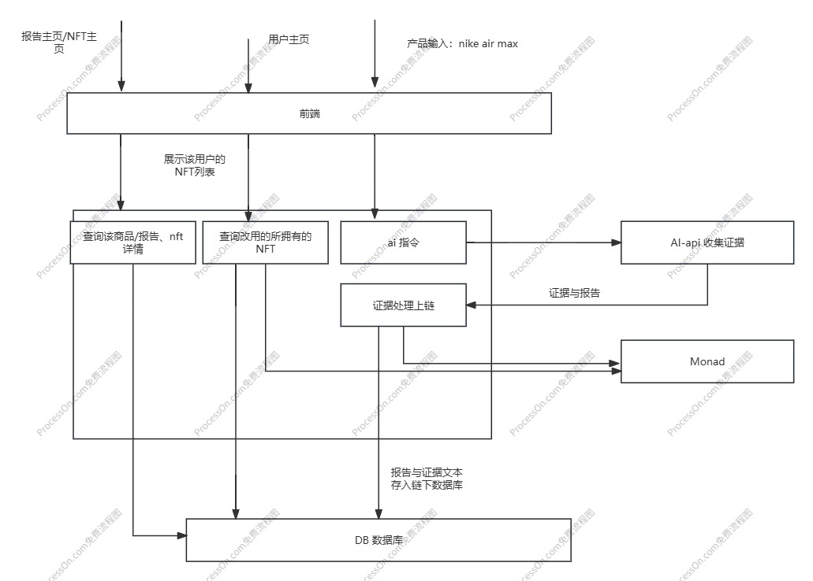

# Development Workflow
Build the smallest runnable version first, then iterate with new features.

# v1
Goal: get the entire end-to-end flow working.  
Frontend: 3 pages — project home, profile page, and product page.  
Backend: 3 mock-data API endpoints; an endpoint to call the AI API; an endpoint to call the Monad contract.  
Smart contracts: implement NFT functionality and Merkle functionality.

## Data Flow Diagram

# v2
Discuss after completing v1, e.g. integration with shopping apps like Taobao, recommending more eco-friendly products based on user input, product NFT trading, etc.